# Stock Market Poker Game

A multiplayer stock market game that combines poker-style betting with stock price predictions. Players compete by predicting stock prices and betting on their predictions in a poker-like environment.

## Live Demo

You can access the live application at: [https://stock-poker.eu](https://stock-poker.eu)

## Features

- Real-time multiplayer gameplay with private/public game lobbies
- Stock market data integration via Twelve Data and Alpha Vantage APIs
- Poker-style betting system with chips, pot, and rounds
- Technical indicators for stock analysis (MACD and RSI)
- News sentiment analysis for informed decisions
- Real-time stock price charts and historical data
- Comprehensive user authentication system
- Interactive and responsive UI with poker-themed design

## Project Setup

### Prerequisites

- Node.js (v14 or later)
- npm (v6 or later)
- Firebase account (for authentication and database)
- API keys for:
  - Twelve Data (stock prices and technical indicators)
  - Alpha Vantage (company information)
  - Marketaux (financial news)

### Environment Variables

Create a `secrets.env` file in the root directory with the following variables:

```
VUE_APP_FIREBASE_API_KEY=your_firebase_api_key
VUE_APP_FIREBASE_AUTH_DOMAIN=your_firebase_auth_domain
VUE_APP_FIREBASE_DATABASE_URL=your_firebase_database_url
VUE_APP_FIREBASE_PROJECT_ID=your_firebase_project_id
VUE_APP_FIREBASE_STORAGE_BUCKET=your_firebase_storage_bucket
VUE_APP_FIREBASE_MESSAGING_SENDER_ID=your_firebase_messaging_sender_id
VUE_APP_FIREBASE_APP_ID=your_firebase_app_id
VUE_APP_FIREBASE_MEASUREMENT_ID=your_firebase_measurement_id
VUE_APP_TWELVE_DATA_API_KEY=your_twelve_data_api_key
VUE_APP_TWELVE_DATA_INDICATORS_API_KEY=your_twelve_data_indicators_api_key
VUE_APP_ALPHA_VANTAGE_API_KEY=your_alpha_vantage_api_key
VUE_APP_MARKETAUX_APIKEY=your_marketaux_api_key
```

### Installation

```
npm install
```

### Compiles and hot-reloads for development

```
npm run serve
```

### Compiles and minifies for production

```
npm run build
```

### Lints and fixes files

```
npm run lint
```

### Running Tests

To run unit tests:
```
npm run test:unit
```

To run unit tests in watch mode:
```
npm run test:unit:watch
```

To run end-to-end tests:
```
npm run test:e2e
```

To run all tests (unit and e2e):
```
npm test
```

For CI environments, you can use:
```
npm run test:ci 
```

## Game Rules

1. Players join a game lobby where the game creator can configure settings
2. Each round consists of several phases:
   - **Stock Selection Phase**: Game creator "spins" to randomly select a stock
   - **Prediction Phase**: Players predict whether the stock price will go up or down
   - **Betting Phase**: Players place bets similar to poker (bet, check, fold)
   - **Information Phases**: 
     - Stock news is revealed to all players
     - Technical indicators (MACD, RSI) are displayed
     - Stock price chart and current price are shown
   - **Winner Determination**: Player with closest prediction wins the pot
3. The game continues for 3 rounds, with winners from e ach round collecting chips
4. After all rounds, the player with the most chips is declared the game winner

## Project Structure

- `src/api/` - API clients for external services (Firebase, stock data, news, etc.)
  - `company-api.js` - Functions for fetching company information
  - `description-api.js` - Functions for fetching stock descriptions
  - `firebase-api.js` - Firebase authentication and database operations
  - `indicator-api.js` - Technical indicator data retrieval
  - `news-api.js` - Financial news and sentiment analysis
  - `stock-api.js` - Stock price and history data
- `src/assets/` - Static assets (images, global styles)
  - `images/` - Image files (logos, UI elements)
  - `styles/` - CSS stylesheets (auth, common, home, lobby)
- `src/components/` - Reusable Vue components
  - `buttons/` - Specialized button components
  - `game/` - Game interface components (PokerTable, PlayerCard, etc.)
    - `hint/` - Informational components (news, indicators, price)
- `src/config/` - Configuration files (API endpoints, keys)
- `src/router/` - Vue Router setup for application navigation
- `src/services/` - Game state management and database interactions
- `src/utils/` - Utility functions (error handling, stock data processing)
- `src/views/` - Application pages/views
  - `auth/` - Authentication views (login, register)

## Architecture Diagram

Below is the UML diagram showing the application's component structure and relationships:



## Technologies Used

- **Frontend Framework**: Vue.js 3 with Composition API
- **State Management**: Pinia
- **Routing**: Vue Router
- **Backend/Database**: Firebase Realtime Database
- **Authentication**: Firebase Authentication
- **Stock Data APIs**:
  - Twelve Data (price data and technical indicators)
  - Alpha Vantage (company information)
  - Marketaux (financial news)
- **Charting**: Chart.js with vue-chartjs
- **HTTP Client**: Axios
- **UI Components**: Custom-built with CSS
- **Notifications**: SweetAlert2
- **Testing**: 
  - Unit tests: Jest
  - End-to-end tests: Cypress

## Development Scripts

```bash
# Install dependencies
npm install

# Serve with hot reload at localhost:8080
npm run serve

# Build for production
npm run build

# Lint and fix files
npm run lint

# Run unit tests
npm run test:unit

# Run unit tests in watch mode
npm run test:unit:watch

# Run end-to-end tests
npm run test:e2e

# Run all tests (unit and e2e)
npm test

# Run tests in CI environment
npm run test:ci
```

## Deployment

This project is configured for deployment using Firebase Hosting.

1. Install the Firebase CLI:
   ```
   npm install -g firebase-tools
   ```

2. Login to Firebase:
   ```
   firebase login
   ```

3. Build the project for production:
   ```
   npm run build
   ```

4. Deploy to Firebase:
   ```
   firebase deploy
   ```

## License

This project is licensed under the MIT License
